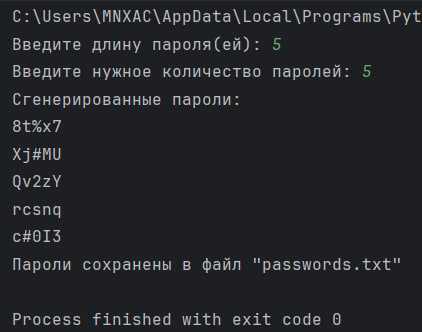

# Исполнитель
Шевцов Михаил Фт-320007

# Краткое описание
Программа генерирует случайные пароли заданной длины и количества, а затем сохраняет их хешированные версии в txt файл. Функция generate_password создает пароль заданной длины, используя случайный выбор из набора символов, включающих буквы, цифры и специальные символы. Функция save_passwords_to_file принимает список паролей, хеширует каждый пароль с помощью алгоритма SHA-256 и записывает хеши в файл passwords.txt. Основная функция main запрашивает у пользователя длину и количество паролей, генерирует их, выводит на экран и сохраняет в файл.

# Среда программирования, язык
PyCharm Community Edition 2024.1.1 ; Python

# Тест
Длина пароля 5 символов, количество паролей 5

